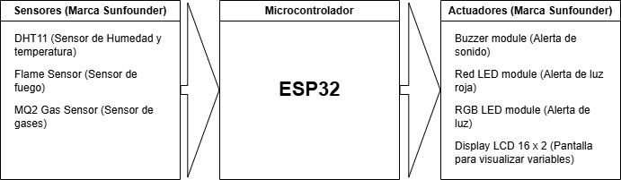
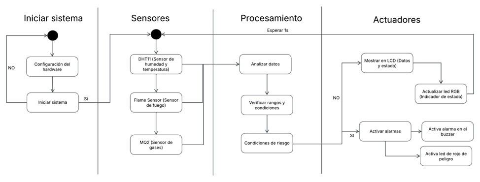
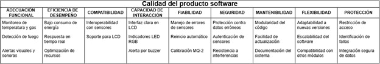
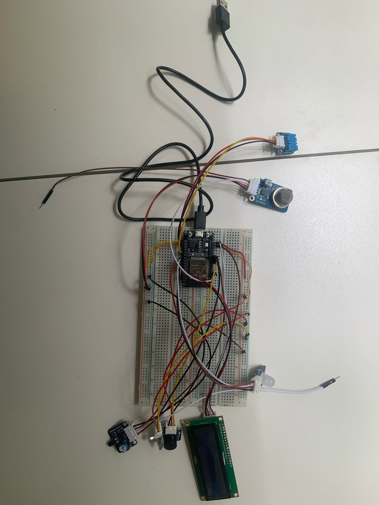
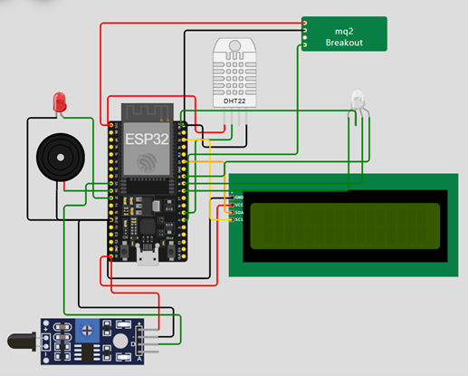

# Sistema IoT para Detección de Incendios en los Cerros Orientales de Bogotá

## Estructura de la documentación
1. [Resumen General](#resumen-general)
   1. [Motivación](#motivación)
   2. [Justificación](#justificación)
2. [Solución Propuesta](#solución-propuesta)
   1. [Restricciones de diseño](#restricciones-de-diseño)
   2. [Arquitectura](#arquitectura)
   3. [Desarrollo teórico modular](#desarrollo-teórico-modular)
   4. [Estándares de diseño de ingeniería aplicadas](#estándares-de-diseño-de-ingeniería-aplicadas)
3. [Configuración Experimental](#configuración-experimental)
   1. [Resultados y Análisis](#resultados-y-análisis)
4. [Autoevaluación del Protocolo de Pruebas](#autoevaluación-del-protocolo-de-pruebas)
   1. [Retos Presentados](#retos-presentados)
5. [Conclusiones](#conclusiones)
   1. [Trabajo Futuro](#trabajo-futuro)
6. [Anexos](#anexos)
   1. [Anexo A. Requerimientos Funcionales](#anexo-a-requerimientos-funcionales)
   2. [Anexo B. Requerimientos No Funcionales](#anexo-b-requerimientos-no-funcionales)
7. [Referencias](#referencias)

---

## Resumen General

Este escrito presenta el desarrollo de un prototipo funcional basado en un sistema IOT, cuyo objetivo es monitorizar en tiempo real las condiciones ambientales en los cerros orientales de la ciudad de Bogotá, Colombia para detectar incendios de forma temprana. La solución desarrollada emplea un **microcontrolador ESP32** junto con sensores de temperatura, humedad, gases, humo y un sensor de llama para evaluar las condiciones del entorno. En caso de detectar condiciones específicas de riesgo, el sistema activa alertas locales mediante actuadores, incluyendo una pantalla LCD, un LED y un buzzer.

### Motivación

A lo largo de la historia los cerros orientales de Bogotá han sido una zona de gran importancia ecológica, sin embargo, debido a factores como la sequía y la actividad humana, estos cerros son susceptibles a incendios forestales. La detección temprana de incendios es fundamental para minimizar daños y proteger tanto el medio ambiente como las comunidades cercanas [1]. Por ello, es necesario implementar sistemas de monitoreo que permitan una respuesta rápida y efectiva ante posibles emergencias, contribuyendo así a la conservación del entorno y la seguridad de la población.

### Justificación

La implementación de un sistema de detección temprana de incendios, sin dependencia de redes de comunicación, garantiza una respuesta inmediata ante condiciones de riesgo, lo que resulta crucial en entornos naturales de difícil acceso y monitoreo continuo. La solución propuesta integra diversas tecnologías y sensores, proporcionando un desarrollo escalable y adaptable, capaz de evolucionar con futuras mejoras e implementaciones en otras regiones con necesidades similares.

---

## Solución propuesta

### Restricciones de diseño

Al iniciar el desarrollo del reto, fue fundamental identificar las diversas restricciones que determinan el diseño, arquitectura e implementación del sistema. Estas restricciones se clasificaron en requerimientos funcionales y no funcionales, que, de acuerdo con investigación realizada, los requerimientos funcionales establecen las capacidades que el sistema debe ofrecer para cumplir con su propósito [2], mientras que los requerimientos no funcionales establecen restricciones de calidad, rendimiento y diseño del sistema [2].
La especificación detallada de los requerimientos funcionales se presenta en el [Anexo A](#anexo-a-requerimientos-funcionales), y los requerimientos no funcionales en el [Anexo B](#anexo-b-requerimientos-no-funcionales).

### Arquitectura

La arquitectura que se implementó para el reto planteado se basa en un sistema centralizado enfocado en el **ESP32**, este microcontrolador es utilizado en el sistema diseñado como la parte central y más importante de la arquitectura, acompañado de este microcontrolador también están los sensores, así como los actuadores, todos estos de la marca Sunfounder. Los sensores utilizados son los siguientes:

* **DHT11.** Sensor de humedad y temperatura del ambiente. Nos entrega estos valores en porcentaje de humedad y la temperatura en grados centígrados.
* **Flame Sensor Module.** Módulo que notifica la presencia de fuego en el ambiente, esto por medio de luz infrarroja, al captar este tipo de luz que emiten las llamas.
* **MQ-2 Gas Sensor.** Sensor de gases en el ambiente, la configuración que tenemos para este sensor es para detectar la cantidad de partes de CO por millón (ppm).

Y los actuadores utilizados son los siguientes:

* **Buzzer.** Actuador que genera ruido como una alerta.
* **LED rojo.** Actuador que emite una luz roja para alertar.
* **LED RGB.** Actuador que cambia de color para señalizar el estado del ambiente.
* **Display LCD 16x2.** Actuador que permite la visualización de las variables del entorno.

El siguiente diagrama muestra el funcionamiento de la arquitectura planteada.

<p align="center">
  
</p>

### Desarrollo teórico modular

El sistema propuesto sigue una arquitectura modular dividida en cuatro componentes principales: inicialización del sistema, sensores, procesamiento y actuadores. El diagrama UML de actividades presentado a continuación ilustra el flujo de operación del sistema, se describe el proceso de adquisición de datos a través de los sensores, su análisis mediante la verificación de rangos y condiciones, y la posterior activación de alarmas y notificaciones en caso de condiciones de riesgo.  

<p align="center">
  
</p>

### Estándares de diseño de ingeniería aplicadas

Seguimos los lineamientos de los siguientes estándares para la realización del reto: 

* **ISO 7240-1:2014. Fire detection and alarm systems — Part 1:** General and definitions  Este estándar hace referencia a sistemas de detección y alarmas de incendios, requerimientos para su interconexión, instalación y pruebas. Además, menciona el funcionamiento esperado por este tipo de sistemas [3]. 

* **ISO 25010. Calidad del producto software.** Hace referencia al grado de satisfacción que alcanza el producto de software al ser utilizado por el usuario aportando valor [4]. 

<p align="center">
  
</p>

* **ISO 22320:2018. Security and resilience — Emergency management — Guidelines for incident management.**  Este estándar marca las pautas para el manejo de incidentes, así como la importancia de comunicar en caso de un incidente [5]. 

---

## Configuración experimental

El proceso inició con la simulación en **Wokwi**, una plataforma en línea que permite diseñar, programar y probar proyectos de electrónica. Este simulador es compatible con múltiples placas, sensores y actuadores, incluyendo Arduino, ESP32, STM32 y Raspberry Pi Pico [6]. En esta fase, se implementó el diseño inicial del sistema, asegurando que cumpliera con los requisitos establecidos. Se desarrolló y probó el código para el ESP32, verificando su correcta interacción con los sensores y actuadores simulados. Durante esta etapa, se evaluó el funcionamiento de cada componente, las conexiones y la lógica del sistema para garantizar su viabilidad antes del montaje físico.

Para la fase de implementación, se replicó la estructura de cableado diseñada en la simulación como se observa en la siguiente figura: 

<p align="center">
  
</p>

Luego se cargó el código en el microcontrolador ESP32. Las pruebas comenzaron con la verificación de la pantalla LCD, asegurando que mostrara correctamente los datos y mensajes esperados. Posteriormente, se evaluó el comportamiento de los sensores, verificando que sus lecturas reflejaran con precisión los cambios en temperatura, llama, humedad, gases y humo. Finalmente, se evaluó el comportamiento de los actuadores, como los LED y el buzzer, verificando que respondieran de acuerdo con la lógica programada y la simulación previa.

### Resultados y Análisis

Tras realizar las pruebas de todos los sensores y los actuadores presentes en el sistema se consiguió el resultado esperado en casi todos los sectores del sistema, a excepción del led RGB, a pesar de ello se logró el objetivo propuesto por el reto, al construir un sistema que cumple los requisitos solicitados. Los videos encontrados en el anexo a este documento muestran el funcionamiento de los actuadores en respuesta a cambios en el ambiente y a la presencia de alguna llama, cabe resaltar que para la realización de las pruebas algunos de los márgenes de seguridad fueron cambiados ya que las condiciones ambientales que se esperan de en los cierros orientales de Bogotá son muy distintos de las condiciones que había en el laboratorio el día del montaje del sistema. 

---

## Autoevaluación del Protocolo de Pruebas

Para validar el correcto funcionamiento del sistema IoT diseñado, se realizaron pruebas tanto en simulación como en el prototipo físico, asegurando que cumpliera con los requisitos mínimos establecidos y respetara las restricciones de diseño identificadas.

En la fase de simulación, se utilizó la plataforma Wokwi, donde se verificó la correcta interacción entre el ESP32, los sensores y los actuadores. Se evaluaron las transiciones entre diferentes estados del sistema, garantizando que las alertas se activaran bajo las condiciones de riesgo esperadas.

Posteriormente, en la fase de prototipado físico, se comprobó que la conexión del hardware con la lógica programada en software fuera precisa. Se realizaron pruebas de respuesta en los sensores de temperatura, humedad, gases y llama, validando la fiabilidad de los datos obtenidos. Adicionalmente, se verificó que los actuadores, como el buzzer, los LEDs y la pantalla LCD, reaccionaran de manera adecuada a los eventos generados por el sistema.

Los resultados obtenidos confirmaron que todas las partes del sistema automático de control operaban correctamente. La integración de sensores, interruptores y actuadores de prototipado rápido permitió replicar con precisión el diseño de la simulación en el montaje físico, evidenciando la viabilidad y efectividad del sistema para la detección temprana de incendios.


### Retos Presentados

Durante el desarrollo del reto surgieron diversos desafíos que afectaron el funcionamiento óptimo del prototipo.

En la fase inicial del montaje físico, surgió un problema relacionado con la versión del microcontrolador ESP32. El equipo contaba con un ESP32 v1, mientras que la simulación y el diseño inicial se habían realizado utilizando un ESP32 v4. Esto generó incompatibilidades en cuanto a la configuración de los pines y sus funcionalidades, lo que dificultó la implementación directa del código y las conexiones planeadas. Como lo indica la documentación técnica, las diferentes versiones del ESP32 pueden variar en la disposición de pines y sus funcionalidades, por lo que es crucial verificar las especificaciones del hardware antes de implementar un proyecto [7]. Para solucionar el inconveniente, se modificaron algunas conexiones para ajustarse a las limitaciones de la versión que se tenía, redistribuyendo los sensores y actuadores en los pines compatibles. Luego, se adaptó el código inicial para utilizar los pines disponibles en el ESP v1, asegurando que las funcionalidades no se vieran afectadas, y por último se hicieron las pruebas necesarias para verificar que todo funcionara correctamente.

Por otro lado, se presentó un reto con el sensor de temperatura y humedad. Durante la simulación se utilizó el DHT22, pero el kit disponible incluía un DHT11. Aunque ambos sensores comparten la misma disposición de pines, lo que permitió realizar la conexión física sin mayores inconvenientes, durante las pruebas se observó que el sensor no mostraba ningún dato en el display. El equipo realizó un análisis de las conexiones y del código, y se detectó que el error residía en la configuración; el código estaba adaptado para el DHT22 y no se había modificado para el DHT11. Una vez actualizado el código, el sensor comenzó a funcionar correctamente. Es importante destacar que, aunque el DHT11 y el DHT22 utilizan la misma interfaz de conexión, difieren en aspectos críticos como el rango de medición, la precisión y la velocidad de respuesta [8].

Otro reto que se presentó al momento de probar el montaje residió en el LED RGB, el cual en el tiempo que contamos no logramos solucionar, esto se debe a que en el simulador virtual de wokwi este Led RGB es de tipo cátodo, pero en el laboratorio solo contabamos con un Led RGB de tipo ánodo, lo cual provoco que este dejara de funcionar correctamente, esto a pesar de que intentamos modificar el código para corregir esta situación.

---

## Conclusiones

El desarrollo e implementación del sistema IOT para la detección temprana de incendios en los cerros orientales de Bogotá ha demostrado ser una solución efectiva y viable para abordar una problemática importante. El prototipo funcional desarrollado integra exitosamente múltiples sensores con un sistema de procesamiento basado en ESP32, cumpliendo con el requisito fundamental de operación autónoma sin dependencia de redes de comunicación. 

La implementación práctica del reto validó la efectividad de la arquitectura propuesta, demostrando la capacidad del sistema para detectar cambios significativos en las condiciones ambientales, procesar datos de múltiples sensores en tiempo real y activar alertas locales de manera confiable. Este proyecto demuestra cómo la aplicación práctica de conocimientos teóricos, combinada con una investigación rigurosa, puede resultar en soluciones tecnológicas que abordan problemáticas ambientales reales.

### Trabajo Futuro
Para el trabajo futuro, se propone la implementación de algoritmos de aprendizaje automático para mejorar la precisión en la detección de condiciones de riesgo, el desarrollo de una red de sensores distribuidos para ampliar el área de cobertura, y la integración de sistemas de energía renovable para mayor autonomía operativa. Estas mejoras permitirían expandir las capacidades del sistema actual y optimizar su funcionamiento en diferentes contextos de aplicación, contribuyendo así a una protección más efectiva de los cerros orientales y otros ecosistemas similares.

---

## Anexos

### Anexo A. Requerimientos Funcionales
| ID    | Descripción |
|-------|------------|
| RF-01 | El sistema debe detectar condiciones ambientales de riesgo mediante sensores de temperatura, humedad, gases, humo y llama. |
| RF-02 | Debe procesar la información en tiempo real utilizando un microcontrolador ESP32. |
| RF-03 | Activar alertas mediante Leds, buzzer y una pantalla LCD al detectar condiciones de riesgo. |
| RF-04 | Operar de manera autónoma sin dependencia de una red de comunicaciones externa. |
| RF-05 | Permitir la visualización de datos ambientales en una pantalla LCD. |

### Anexo B. Requerimientos No Funcionales
| ID    | Descripción |
|-------|------------|
| RNF-01 | Se requiere el uso de un microcontrolador embebido como ESP32, sin la posibilidad de emplear Raspberry Pi. |
| RNF-02 | La arquitectura debe ser modular para permitir futuras expansiones. |
| RNF-03 | La solución debe ser de bajo costo y eficiente, garantizando la viabilidad de un posible escalamiento. |
| RNF-04 | El dispositivo debe ser compacto y resistente a factores adversos del entorno, como humedad, polvo y temperatura extrema. |
| RNF-05 | El sistema debe tener un 99% de disponibilidad, asegurando la detección y alerta de incendios sin interrupciones críticas.|

### Anexo C. Simulación del circuito

<p align="center">
  
</p>

[Simulación Wokwi](https://wokwi.com/projects/422564181816132609)

### Anexo D. Documentación del codigo

```ino

#include <DHT.h>
#include <Wire.h>
#include <LiquidCrystal_I2C.h>
#include <MQUnifiedsensor.h>

// Definición de pines
#define DHTPIN 4
#define DHTTYPE DHT11
#define LED_PIN 27
#define BUZZER_PIN 26
#define FLAME_PIN 25
#define Board "ESP-32"
#define Pin 34  // Pin ADC para el sensor de gas

// Configuración del sensor de gas MQ-2
#define Type "MQ-2"
#define Voltage_Resolution 3.3
#define ADC_Bit_Resolution 12 
#define RatioMQ2CleanAir 9.83

// Definición de pines para LEDs RGB
#define RED_PIN 5
#define GREEN_PIN 18
#define BLUE_PIN 19

// Umbrales de temperatura y humedad
#define TEMP_LOW 8.4
#define TEMP_HIGH 13
#define HUMI_LOW 75
#define HUMI_HIGH 80
#define FIRE_THRESHOLD LOW

// Configuración del LCD I2C
#define I2C_ADDR 0x27
#define LCD_COLUMNS 16
#define LCD_LINES 2

// Inicialización de sensores y pantalla LCD
DHT dht(DHTPIN, DHTTYPE);
LiquidCrystal_I2C lcd(I2C_ADDR, LCD_COLUMNS, LCD_LINES);
MQUnifiedsensor MQ2(Board, Voltage_Resolution, ADC_Bit_Resolution, Pin, Type);
int valor_gas = 0; 

void setup() {
  lcd.clear();
  Serial.begin(115200);
  
  // Configuración de pines de entrada/salida
  pinMode(LED_PIN, OUTPUT);
  pinMode(BUZZER_PIN, OUTPUT);
  pinMode(FLAME_PIN, INPUT);
  pinMode(RED_PIN, OUTPUT);
  pinMode(GREEN_PIN, OUTPUT);
  pinMode(BLUE_PIN, OUTPUT);

  // Inicialización del sensor de gas MQ-2
  MQ2.setRegressionMethod(1);
  MQ2.setA(36974); 
  MQ2.setB(-3.109);
  MQ2.init(); 

  // Inicialización del LCD
  lcd.init();
  lcd.backlight();
  lcd.setCursor(4, 0);
  lcd.print("----*----");
  lcd.setCursor(2, 1);
  lcd.print("Alarm System");
  delay(1000);
  lcd.clear();

  // Calibración del sensor MQ-2
  Serial.print("Calibrating please wait.");
  float calcR0 = 0;
  for(int i = 1; i <= 10; i++) {
    MQ2.update();
    calcR0 += MQ2.calibrate(RatioMQ2CleanAir);
    Serial.print(".");
  }
  MQ2.setR0(calcR0 / 10);
  Serial.println(calcR0);
  lcd.clear();
  lcd.setCursor(0, 0);
  lcd.print("MQ2 = ");
  lcd.print(calcR0);
  delay(500);
}

void loop() {
  // Lectura de temperatura y humedad
  float temp = dht.readTemperature();
  float humi = dht.readHumidity();

  // Mostrar temperatura y humedad en LCD
  lcd.setCursor(0, 0);
  lcd.print("Temp: ");
  lcd.print(temp);
  Serial.println("Temperatura:" + String(temp));
  lcd.print("'C");
  lcd.setCursor(0, 1);
  lcd.print("Humi: ");
  lcd.print(humi);
  Serial.println("Humedad: " + String(humi));
  lcd.print(" %");
  delay(1000);

  // Lectura del sensor de gas MQ-2
  MQ2.update();
  MQ2.readSensor();
  valor_gas = analogRead(Pin);
  valor_gas = map(valor_gas, 0, 4095, 0, 100);
  Serial.println(valor_gas);
  lcd.clear();
  lcd.setCursor(0,0);
  lcd.print("MQ2 = ");
  lcd.print(valor_gas);
  delay(1000);
  lcd.clear();

  // Detección de fuego
  if (digitalRead(FLAME_PIN) == LOW) {  // Sensor activa LOW si detecta fuego
    digitalWrite(LED_PIN, HIGH);
    tone(BUZZER_PIN, 1000);
    lcd.clear();
    lcd.setCursor(0, 0);
    lcd.print("FUEGO");
    lcd.setCursor(0, 1);
    lcd.print("DETECTADO!!");
    Serial.println("** ¡Fuego detectado! **");
    delay(1000);
    lcd.clear();
  } else {
    digitalWrite(LED_PIN, LOW);
    noTone(BUZZER_PIN);
    lcd.clear();
    lcd.setCursor(0, 0);
    lcd.print("NO HAY");
    lcd.setCursor(0, 1);
    lcd.print("FUEGO");
    Serial.println("No se detecta fuego");
    delay(1000);
    lcd.clear();
  }
  delay(100);

  // Verificación de temperatura y control de LED RGB
  if(temp > TEMP_LOW && temp < TEMP_HIGH) {
    lcd.clear();
    lcd.setCursor(0, 0);
    lcd.print("Temp ok");
    lcd.setCursor(0, 1);
    lcd.print("Sin alertas");
    delay(1000);
    setRGB(0, 255, 0);
    lcd.clear();
  } else if(temp > TEMP_HIGH) {
    lcd.clear();
    lcd.setCursor(0, 0);
    lcd.print("Temp alta");
    lcd.setCursor(0, 1);
    lcd.print("Precaucion");
    delay(1000);
    setRGB(255, 0, 0);
    lcd.clear();
    if (humi < HUMI_LOW) {
      digitalWrite(LED_PIN, HIGH);
      tone(BUZZER_PIN, 1000);
      lcd.clear();
      lcd.setCursor(0, 0);
      lcd.print("Humedad baja");
      lcd.setCursor(0, 1);
      lcd.print("Fuego detectado!");
      delay(1000);
      digitalWrite(LED_PIN, LOW);
      noTone(BUZZER_PIN);
      lcd.clear();
    }
  } else if(temp < TEMP_LOW) {
    lcd.clear();
    lcd.setCursor(0, 0);
    lcd.print("Temperatura baja");
    lcd.setCursor(0, 1);
    lcd.print("Cuidado frio");
    delay(1000);
    setRGB(0, 0, 255);
    lcd.clear();
  }

  // Verificación de humedad
  if (humi < HUMI_LOW) {
    digitalWrite(LED_PIN, HIGH);
    lcd.clear();
    lcd.setCursor(0, 0);
    lcd.print("Humedad baja");
    lcd.setCursor(0, 1);
    lcd.print("Posible incendio");
    delay(1000);
    digitalWrite(LED_PIN, LOW);
  }
}

// Función para controlar el color del LED RGB
void setRGB(int red, int green, int blue) {
  ledcWrite(0, 255 - red);
  ledcWrite(1, 255 - green);
  ledcWrite(2, 255 - blue);
}

```

---

## Referencias

[1] J. M. A. L. King, "Challenge#1 Statement", Microsoft Teams, 17 de febrero de 2025. [En línea]. 

[2] ISO/IEC/IEEE. (2011). "Systems and software engineering - Requirements engineering". ISO/IEC/IEEE 29148:2011. 

[3] ISO 22320:2018. Security and resilience — Emergency management — Guidelines for incident management (2018). [En línea]. Disponible: https://www.iso.org/obp/ui/en/#iso:std:iso:22320:ed-2:v1:en [Accedido: Feb. 17, 2025]. 

[4] ISO 25000. "ISO/IEC 25010". [En línea]. Disponible: https://iso25000.com/index.php/normas-iso-25000/iso-25010 [Accedido: Feb. 17, 2025]. 

[5] ISO 7240-1:2014(en). Fire detection and alarm systems — Part 1: General and definitions (2014). [En línea]. Disponible: https://www.iso.org/obp/ui/en/#iso:std:iso:7240:-1:ed-3:v1:en [Accedido: Feb. 17, 2025]. 

[6] "Welcome to Wokwi!" Wokwi Documentation, [Online]. Available: https://docs.wokwi.com/. [Accessed: 13-02-2025]. 

[7] Espressif Systems, "ESP32 Series Datasheet," 2020. [En línea]. Disponible: https://www.espressif.com/sites/default/files/documentation/esp32_datasheet_en.pdf. [Accedido: Feb. 12, 2025]. 

[8] Adafruit Industries, “DHT11 and DHT22: Temperature and Humidity Sensors,” 2025. [En línea]. Disponible: https://learn.adafruit.com/dht 


---
